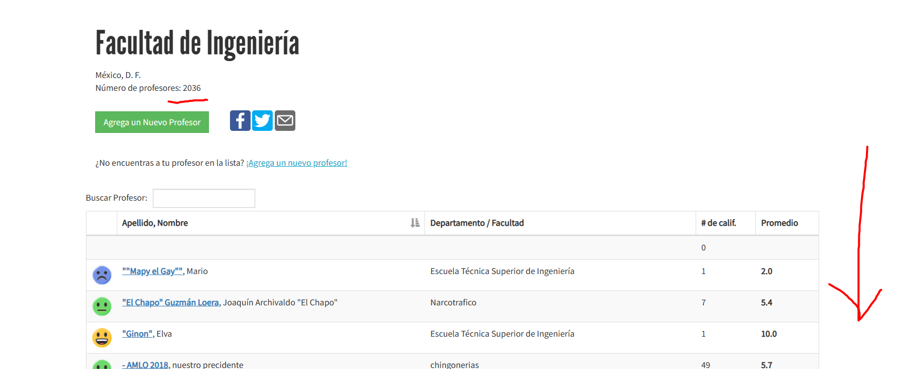
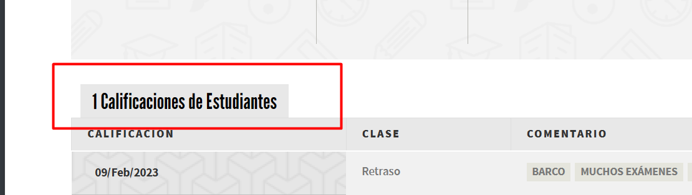
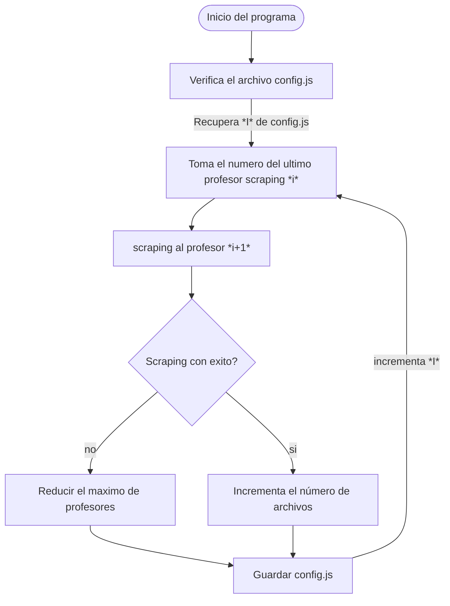
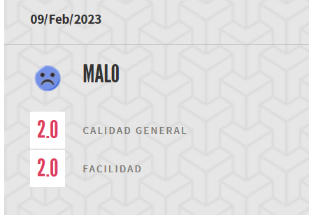
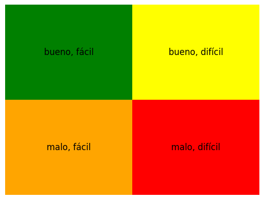

```yaml
Nombre Alumno: Barrera Peña Víctor Miguel
Titulo: Proyecto final análisis de texto
subtitulo:  Analisis los sentimientos comentarios profesores (misprofesores.com)
nombre de programa: Analizador misProfesores
Fecha de publicación: 08/05/2023
```

# Objetivo

El propósito es desarrollar un analizador de textos sofisticado que pueda discernir si un comentario es positivo, negativo o engañoso. Este instrumento deberá ser capaz de seleccionar a los profesores mejor calificados, basándose en los comentarios realizados en relación a una asignatura específica, con el fin de facilitar el proceso de inscripción. Este sistema de evaluación permitirá que los estudiantes tomen decisiones más informadas sobre qué profesores elegir, y ayudará a asegurar la calidad educativa y la satisfacción del estudiante.

# Introducción

La emergencia de la inteligencia artificial y del procesamiento del lenguaje natural (PLN) ha cambiado radicalmente la forma en que se procesa y se analiza la información textual. BERT (Bidirectional Encoder Representations from Transformers) es uno de los modelos que ha probado su eficiencia en variadas tareas de PLN, incluyendo el análisis de sentimientos y la detección de comentarios falsos.

Mi intención es desarrollar un analizador de texto que utilice BERT para discernir si los comentarios relacionados con la evaluación de profesores son positivos, negativos o engañosos. Este sistema será una herramienta útil para los estudiantes, ayudándoles a tomar decisiones informadas al inscribirse en cursos, eligiendo a los profesores mejor calificados.

Sin embargo, debo enfatizar que el camino hacia la realización de este proyecto está lleno de desafíos. Lograr una interpretación precisa de los sentimientos y detectar comentarios falsos exige un ajuste meticuloso del modelo y un entrenamiento riguroso.

# Desarrollo

## Construcción del programa

1. **Extractor de comentarios:** Este programa realiza *scraping* a la página misprofesores.com utilizando **Beautiful Soup**, almacenando los comentarios en archivos JSON individuales por cada profesor. De esta forma, los comentarios de cada docente se guardan de manera independiente.

2. **Almacenamiento en una base de datos adicional:** Es impráctico obtener todos los datos de todos los profesores de manera simultánea, dado que cada docente cuenta con múltiples páginas de comentarios. Por ello, se guarda una especie de *cache* que indica cuándo fue la última vez que se recuperaron los comentarios de cada profesor.

3. **Creación de un archivo de datos para el entrenamiento:** Se genera un archivo de datos con el objetivo de poder entrenar el modelo de datos BERT.

4. **Entrenamiento del modelo BERT:** Con los datos previamente obtenidos y organizados, se procede a entrenar el modelo BERT.

5. **Prueba del modelo** con datos diferentes a los utilizados durante el entrenamiento, con el fin de observar su comportamiento.

6. **Elaboración de estadísticas y métricas:** Para verificar su eficacia, se realizarán estadísticas y métricas, y se elaborará un informe de ello. Esto se llevará a cabo utilizando un conjunto de prueba con posibles respuestas, que son diferentes a las respuestas con las que se entrenó el modelo.

# Diario de viaje  (resolviendo el problema)

## Extracción de datos de la página web (lista de profesores) mediante técnicas de scraping

```yaml
pagina: https://www.misprofesores.com/escuelas/Facultad-de-Ingenieria_1511
```

Se detectó un problema relacionado con una etiqueta o algún otro aspecto al intentar obtener la información a través de técnicas de scraping. Sin embargo, al utilizar un navegador, se observó que este corrigió el error debido a la flexibilidad de HTML y JavaScript. La opción más obvia y exitosa resultó ser realizar el scraping directamente desde el navegador, aprovechando el motor de renderizado HTML y JavaScript que corrigió los errores.

La solución consistió en utilizar la consola del navegador para llevar a cabo el scraping. Los datos se obtuvieron utilizando el método `document.getElementById`, y la salida de la consola se redirigió a un archivo de texto que se descargó en el navegador una vez que se completó la extracción de datos de los profesores.


El siguiente código se realiza dicha extracción:

```js
console.save = function(data, filename) {
  if (!data) {
    console.error('No hay datos para guardar en el archivo.');
    return;
  }

  if (!filename) {
    filename = 'console.log';
  }

  if (typeof data === 'object') {
    data = JSON.stringify(data, undefined, 2);
  }

  var blob = new Blob([data], { type: 'text/plain' });
  var url = URL.createObjectURL(blob);

  var a = document.createElement('a');
  a.href = url;
  a.download = filename;
  a.click();
};

// Variable para almacenar la salida de la consola
var salida = '';

document.querySelectorAll('table td.visible-xs').forEach(function(celda) {
  // Verificar si la celda contiene un enlace con un atributo href
  var enlace = celda.querySelector('a');
  if (enlace && enlace.hasAttribute('href')) {
    // Obtén el href y el texto "inherit" de la celda
    var href = enlace.getAttribute('href');
    var texto = celda.textContent.trim();
     

    // Haz algo con el href y el texto
    salida += 'href: ' + href + '\n';
    salida += 'Texto: ' + texto + '\n';
  }
});

// Guardar la salida en un archivo
console.save(salida, 'profesores.txt');
```


El programa tiene que realizarse en la pagina principal de mis `misprofesores.com` para una universidad, para el caso de mi universidad es 

```
https://www.misprofesores.com/escuelas/Facultad-de-Ingenieria_1511
```



El número en **rojo** acerca del número de profesores tienes que tenerlo presente ya que en la configuracion inicial (la primera vez que ejecutes el programa) te pedirá ese dato :2036.

## ¿De qué tamaño es el conjunto? 

Para comprobar que la extracción sea correcta y también para saber de cuantos elementos es el conjunto de entrenamiento es necesario tener el número de cometarios

Por lo que había comentado de una etiqueta mal hecha realice una extracción directamente del navegador de la siguiente página

```yaml
pagina: https://www.misprofesores.com/escuelas/Facultad-de-Ingenieria_1511
```

con el siguiente script

```js
// Seleccionar todos los elementos <td> en la quinta posición (donde está el valor "0")
var tdElements = document.querySelectorAll('tr.odd td:nth-child(5)');

// Iniciar una variable para la suma
var suma = 0;

// Iterar a través de todos los elementos <td>
for (var i = 0; i < tdElements.length; i++) {
    // Obtener el valor de texto del elemento <td> y convertirlo a un número
    var valor = parseInt(tdElements[i].textContent);
  
    // Añadir el valor a la suma
    suma += valor;
}

// Mostrar la suma en la consola
console.log("La suma de todos los valores es: " + suma);
```

Ejecución:

```
La suma de todos los valores es: 11781
```

El conjunto es pequeño (11,781) , ya que con el conjunto de enteramiento con los que he observado que entrenan superan fácilmente los 40,000. Sin embargo hay que tener algo muy presente, puede que algunos comentarios están o estarán en **en revisión**, por lo cual se descartan y como resultado el conjunto total de comentarios puede ser menor. 

## Extracción de  los comentarios de cada profesor

A partir del documento `profesores.txt` que tiene la siguiente estructura

```yaml
href: https://www.misprofesores.com/profesores/Omar-Abrego-Blancas_161282
Texto: Abrego Blancas, OmarDIE
href: https://www.misprofesores.com/profesores/Omar-Edsiel-Abrego-Blancas_161304
Texto: Abrego Blancas, Omar EdsielFacultad de ingeniería
href: https://www.misprofesores.com/profesores/Anays-Acevedo-Barrera_150151
Texto: Acevedo Barrera, AnaysFacultad de Ingeniería
href: https://www.misprofesores.com/profesores/Guiomar-Acevedo-Lopez_78442
Texto: Acevedo Lopez, GuiomarFacultad de ingeniería
href: https://www.misprofesores.com/profesores/HERMINIO-ACEVEDO-VALLE_55012
Texto: ACEVEDO VALLE, HERMINIOFacultad de Ingeniería UNAM
...
```

Del archivo de `profesores.txt` hay que recuperar el link y el nombre del profesor y hay que colocarlo en una lista de `links` y otra de `textos` se logró con la siguiente código:

```python
def ExtraerNombres_links_profes(nombre_archivo:str)->tuple[list[str], list[str]]:
    """Extra los nombres de profesores y links del archivo profesores.txt

    Args:
        nombre_archivo (str): profesores.txt

    Returns:
        tuple[list[str], list[str]]: lista[lista_textp],lista[lista_links]
    """
    # Primero, inicializamos las listas vacías
    lista_texto:list[str] = []
    lista_links:list[str] = []

    # Abrimos el archivo y leemos línea por línea
    with open(nombre_archivo, 'r', encoding='utf-8') as f:
        for line in f:
            # Quitamos los espacios al principio y al final
            line = line.strip()
            # Si la línea comienza con "Texto:", la agregamos a la lista de texto
            if line.startswith('Texto:'):
                # Quitamos el "Texto:" al principio y lo agregamos a la lista
                lista_texto.append(line[6:])
            # Si la línea comienza con "href:", la agregamos a la lista de links
            elif line.startswith('href:'):
                # Quitamos el "href:" al principio y lo agregamos a la lista
                lista_links.append(line[5:])

    # Devolvemos las dos listas
    return lista_texto, lista_links
```

## No se puede  realizar de todas las extracciones  una tras otra

Siendo una página web  y un servidor que no es tan potente al realizar 11,000, y 239 profesores, al menos tendría que realizar +400 peticiones, si se hace una tras otra me van a bloquear o puede que tirar el sitio, por tanto lo haré de manera más discreta montado en un servidor que esporádicamente hará las peticiones teniendo un tiempo aleatorio  (24 horas del día).


## Archivo de configuración

Para saber que  

## Funcionamiento del programa


# Problema de las paginas web

Al tratar de obtener el número de cuantas paginas hay por cada profesor, hay un problema al obtener el número de páginas para algunos problemas, ya sea por un error de etiquetas o porque se renderiza con JavaScript y por ello se tendría que utilizar algo más potente que `Beautiful Soup` , la solución obvia fue calcular aproximadamente cuantas páginas.

**Se descartó:**


Entrando a cualquier profesor a la primera página de comentarios, se puede obtener el número de comentarios



y sabiendo que se muestran 5 comentarios por página, si tiene 6 comentarios, se tienen que hacer `scraping`  a la página 1,2, ya que hay 5 en la primera y 1 en la siguiente.

# Mejorando el scraping

No todo es posible que corra en un servidor, también es necesario que pueda continuar en automatico sin estar todo el tiempo disponible para hacer scraping, por eso utilizando en archivo de configuración guarda el último documento que fue scrapeado, la solución es suponiendo que se tiene un arreglo con todos los profesores y sus links, si el último que fue scrapeado fue el `profesor [100]` entonces se que `100` fue el último y este dato esta guardado en alchivo 

```
config.json
```

La manera que en se realiza




Lo que ocasiona el anterior flujo  ocasiona que si se interrumpe en cualquier momento el flujo anterior, va regresar al ultimo estado estable, que es cuando se guardo el ultimo scraping del anterior profesor, esto funciona mientras sigas teniendo la base datos `.sql` y  los archivos `.json` que contienen los comentarios de cada profesor.

## Crear el dataset de entrenamiento 

Cuando ya se tenga completado todos los archivos `.json` se crea un archivo `.csv` que contiene la siguiente estructura:

| review                                                       | sentiment |
| ------------------------------------------------------------ | --------- |
| One of the other reviewers has mentioned that after watching just 1 Oz episode you'll be hooked. They are right, as this is exactly what happened with me.<br /><br /> | positive  |
| A wonderful little production.                               | positive  |
| I thought this was a wonderful way to spend time on a too hot summer weekend, sitting in the air conditioned theater and watching a light-hearted comedy. The plot is simplistic, but the dialogue is witty and the characters are likable (even the well bread suspected serial killer). While some may be disappointed when they realize this is not Match Point 2: Risk Addiction, | positive  |

De donde me baso para mi trabajo de investigación usaron el `Bert` en la versión ingles, además de tener comentarios en ingles, son comentarios largos y por eso acortaron el entrenamiento a 200 tokens, los resultados son posibles en 2 estados, sin embargo para este caso  son 4 estados, lo usaré con comentarios más pequeños, además el set de entrenamiento es mucho menor, y por supuesto  el modelo usado es `BETO` la versión en español de `Bert`.

## Crear dataSet de sentimientos

Para mi caso especifico he creado 4 categorias.

Tengo dos parámetros con los que puedo analizar la posibilidad 

Malo <=5 o  5< Bueno  en cuanto **Calidad general** 

Fácil <= 5 ,5< Dificil en **facilidad**



Entonces estoy re mapeando queda la siguiente manera



# Resultado

Existe en el menú principal un modo que compara el archivo `dataSet-input.csv` que es la entrada con la que el modelo funciona

# Conclusión

# Visión futura

- El programa sirve perfectamente para entender como es que se comporta el profesor  de acuerdo a sus comentarios, simplifica la elección de profesores basado en comentarios,  podria decirse que podria clasificarse cierta medida a partir de los datos para seleccionar a profesores a incribir depndiendo de las necesidades de cada alumno.
- Podría unirse este analizador de sentimientos a **Facebook** para tener un análisis más profundo, y posterior a tener clasificación total del profesor basado en estadística y quedaría dado los resultados de todos los comentarios dados por los compañeros,  también podría unirse a un programa ya existente que realice para crear las posibles configuraciones de horarios, y escoger horario de acuerdo con comentarios.
- Puede implementarse interfaces gráficas para mejorar la experiencia de este programa.
- La detección de comentarios que buscan  confundir  

# Referencias

- mrm8488. (2023, 29 de mayo). BETO_getting_started.ipynb. GitHub. https://colab.research.google.com/github/mrm8488/beto/blob/master/BETO_getting_started.ipynb

- Mermaid. (2023, 29 de mayo). Sintaxis de los diagramas de flujo. https://mermaid.js.org/syntax/flowchart.html

- QData. (2023, 29 de mayo). Example_4_CamemBERT.ipynb - Colaboratory. GitHub. https://colab.research.google.com/github/QData/TextAttack/blob/master/docs/2notebook/Example_4_CamemBERT.ipynb#scrollTo=koVcufVBD9uv

- CamemBERT. (2023, 29 de mayo). CamemBERT. https://camembert-model.fr/

- YouTube. (2023, 29 de mayo). [Video]. https://www.youtube.com/watch?v=IRtHuwSPaGo

- Wb-az. (2023, 29 de mayo). Transformers-Emotion-Analysis. GitHub. https://github.com/Wb-az/Transformers-Emotion-Analysis

- codificandobits. (2023, 29 de mayo). Analisis_de_sentimientos_con_BERT/BERT_analisis_sentimientos.ipynb. GitHub. https://github.com/codificandobits/Analisis_de_sentimientos_con_BERT/blob/master/BERT_analisis_sentimientos.ipynb

- Codificando Bits. (2023, 29 de mayo). Análisis de sentimientos con BERT en Python (Tutorial) [Video]. YouTube. https://www.youtube.com/watch?v=mvh7DV84mr4

- Codificando Bits. (2023, 29 de mayo). Comprensión de texto con BERT en PYTHON (Tutorial) [Video]. YouTube. https://www.youtube.com/watch?v=iPrwWtVl0LM

- Chat GPT 4.0 con Pluggins  (May 24,2023)

Das últimas 3 referencias son las que hacen entender cada parte del código
